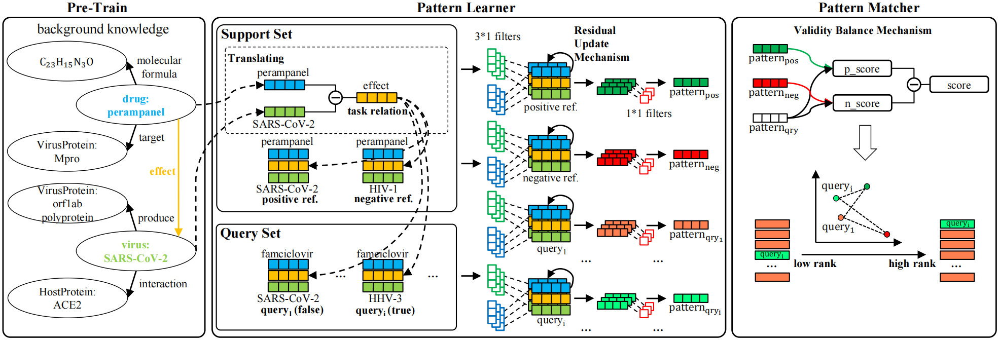

# MetaP
Source code of MetaP

## Method Overview
<p align="center"></p>

## Dataset
- [NELL-One](https://sites.cs.ucsb.edu/~xwhan/datasets/nell.tar.gz)
- [COVID19-One](https://drive.google.com/file/d/1VkIGj_js2AhARSpSxPAs_9IDfcHmlfRm/view?usp=sharing)
  
## Requirements
- `PyTorch==1.6.0`
- `Python==3.7.10`

### Pre-Trained Embeddings
- [NELL-One](https://drive.google.com/file/d/1XXvYpTSTyCnN-PBdUkWBXwXBI99Chbps/view?usp=sharing)

## Training
* With random initialized embeddings: ``python main.py --fine_tune --data_form Discard``
* With pretrained embeddings: ``python main.py --fine_tune --data_form Pre-Train``

## Reference

```
@inproceedings{jiang2021metap,
  title={MetaP: Meta Pattern Learning for One-Shot Knowledge Graph Completion},
  author={Jiang, Zhiyi and Gao, Jianliang and Lv, Xinqi},
  booktitle={Proceedings of the 44th International ACM SIGIR Conference on Research and Development in Information Retrieval},
  pages={2232--2236},
  year={2021}
}
```